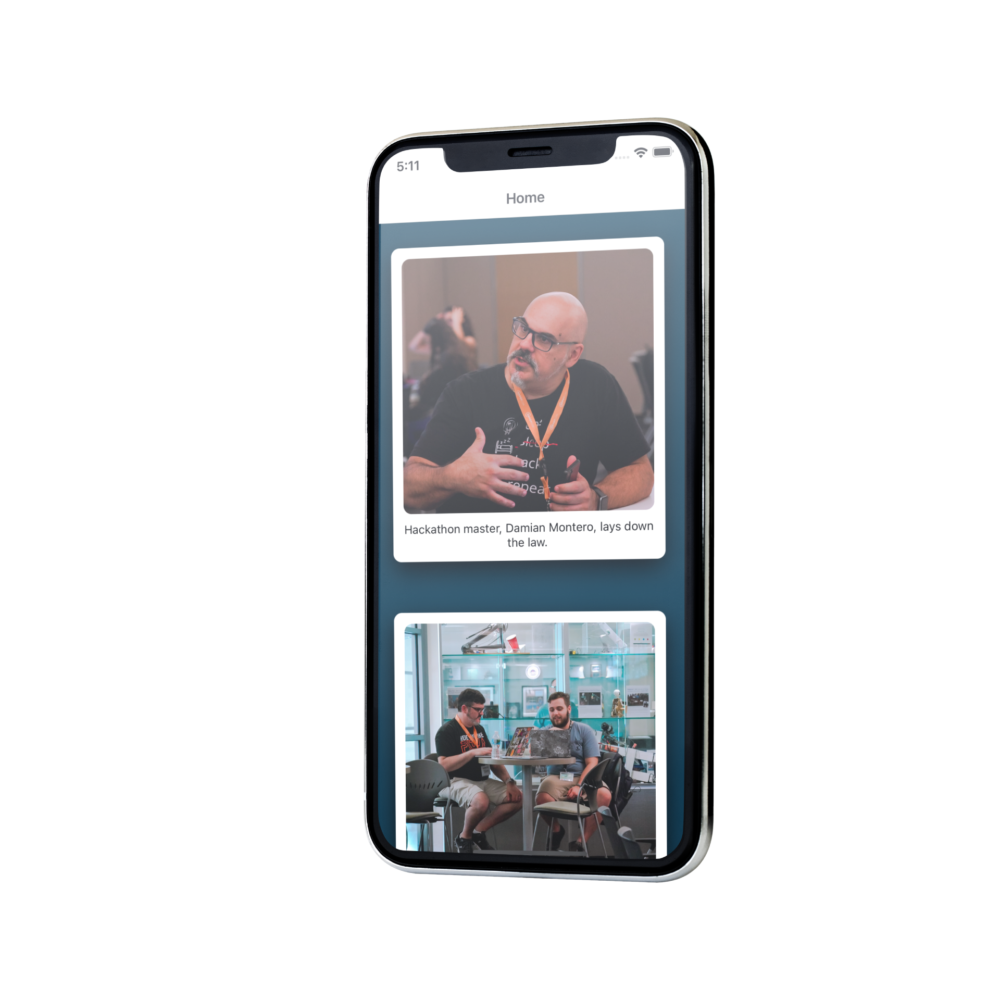

# Instagram Clone - React Native

## Lessons Learned

What did you learn while building this project? 

- Using React Native we created a Instagram Clone, and with useState and useEffect we pulled data from an API to produce images and descritions for the Instagram feed. Also styled components with inline styling.

## Documentation

[React Documentation](https://reactnative.dev)

## 🔗 Links

